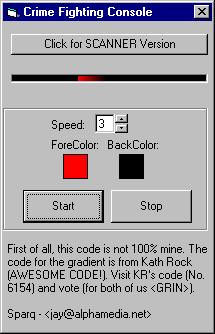



## AWESOME\!\! Red Scrolling Light From The Front of The Knight Rider Car \- Custom Control\! MUST SEE\!\!

### Description

Wow.. talk about cool replicas. I used KR's Awards winning Gradient control for this code. A Custom Control that when placed on your form mimics the red swooshing light on the front of KITT, the car from Knight Rider. You can change the BackColor, ForeColor and the speed at which it swooshes.
 
### More Info
 

             |
---                |---
**Submitted On**   |2000-08-24 13:18:20
**By**             |[Sparq](https://github.com/Planet-Source-Code/PSCIndex/blob/master/ByAuthor/sparq.md)
**Level**          |Beginner
**User Rating**    |4.3 (13 globes from 3 users)
**Compatibility**  |VB 5\.0, VB 6\.0
**Category**       |[Custom Controls/ Forms/  Menus](https://github.com/Planet-Source-Code/PSCIndex/blob/master/ByCategory/custom-controls-forms-menus__1-4.md)
**World**          |[Visual Basic](https://github.com/Planet-Source-Code/PSCIndex/blob/master/ByWorld/visual-basic.md)
**Archive File**   |[CODE\_UPLOAD92688242000\.zip](https://github.com/Planet-Source-Code/sparq-awesome-red-scrolling-light-from-the-front-of-the-knight-rider-car-custom-control-mu__1-10973/archive/master.zip)

